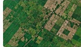
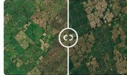
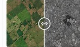

# SatQuery AI

### Vision-Language Assistant for Satellite Image Analysis

SatQuery AI is an interactive **vision-language assistant for remote-sensing image analysis**. It allows users to upload satellite imagery and ask natural-language questions about the image, selected regions, changes over time, or complementary Optical and SAR data.


## Overview

SatQuery AI combines a modern React workflow with a FastAPI backend and GeoChat-based vision-language models to provide intelligent analysis of satellite imagery.

The system supports:

* Single satellite image analysis
* Natural-language Visual Question Answering (VQA)
* Image captioning
* Region/grounding analysis
* Bi-temporal change analysis
* Optical + SAR image analysis
* Visual evidence and confidence information
* Analysis history
* Downloadable analysis results

---

## Supported Analysis Modes

### 1. Single Image

Users can upload a single optical or multispectral satellite image and ask questions about the scene.



### 2. Bi-Temporal Change Analysis

Users can provide before-and-after satellite images to identify changes in an area.



The system can identify:

* What changed
* Where the change occurred
* Increase or decrease
* Unchanged regions
* Spatial evidence of the detected change

### 3. Optical + SAR Fusion

SatQuery AI can analyze complementary Optical and SAR imagery together.



This allows the system to combine information from different satellite sensors for improved interpretation.

---

## Application Workflow

```text
Upload Image
      ↓
Select Area
      ↓
Ask Question
      ↓
Analytics
      ↓
View Results
      ↓
Analysis History
```

---

## System Architecture

```text
                    ┌──────────────────────┐
                    │        User          │
                    └──────────┬───────────┘
                               │
                               ▼
                    ┌──────────────────────┐
                    │    React + Vite      │
                    │       Frontend       │
                    └──────────┬───────────┘
                               │
                               ▼
                    ┌──────────────────────┐
                    │       FastAPI        │
                    │        Backend       │
                    └──────────┬───────────┘
                               │
                               ▼
                    ┌──────────────────────┐
                    │    AI Agent Layer    │
                    └──────────┬───────────┘
                               │
                ┌──────────────┼──────────────┐
                ▼              ▼              ▼
          ┌─────────┐    ┌─────────┐    ┌─────────┐
          │   VQA   │    │ Change  │    │Optical +│
          │Caption  │    │Analysis │    │   SAR   │
          └────┬────┘    └────┬────┘    └────┬────┘
               │              │              │
               └──────────────┼──────────────┘
                              ▼
                    ┌──────────────────────┐
                    │      GeoChat-7B      │
                    │    + LoRA Adapters   │
                    └──────────────────────┘
```

---

## Technology Stack

### Frontend — MERN

* React
* Vite
* JavaScript
* HTML
* CSS

### Backend

* Python
* FastAPI
* Uvicorn
* Pillow
* NumPy
* Rasterio
* PyTorch
* Transformers
* PEFT

### AI / Machine Learning

* GeoChat-7B
* LoRA adapters
* Vision-Language Models
* Remote-sensing image analysis

### Datasets

* GeoChat
* BigEarthNet
* SECOND

---

## Project Structure

```text
SatQuery-AI/
│
├── frontend/
│   ├── public/
│   │   └── images/
│   ├── src/
│   ├── package.json
│   └── vite.config.js
│
├── backend/
│   ├── tasks/
│   ├── utils/
│   ├── agent_executor.py
│   ├── agent_router.py
│   ├── model_manager.py
│   ├── response_builder.py
│   ├── config.py
│   ├── app.py
│   └── requirements.txt
│
└── README.md
```

---

## Team Members

### Backend & AI Team

| No. | Team Member    |
| --- | -------------- |
| 1   | **Sreeneedhi** |
| 2   | **Bhavana**    |
| 3   | **Deedeepya**  |

### MERN Development Team

| No. | Team Member |
| --- | ----------- |
| 1   | **Anusha**  |
| 2   | **Reshma**  |
| 3   | **Mamatha** |

---

## Task Mapping

| User Input                    | Task              |
| ----------------------------- | ----------------- |
| Single image VQA              | VQA               |
| Image Captioning              | Captioning        |
| Grounding / Region Analysis   | Grounding         |
| Before & After Images         | Change Analysis   |
| Change Detection              | Change Analysis   |
| Optical + SAR                 | Multimodal Fusion |
| Multimodal Satellite Analysis | AI Analysis       |

---

## Security

The backend includes security measures such as:

* API-key authentication support
* Upload size limits
* Image validation
* CORS allow-list
* Rate limiting
* Security response headers
* Server-side secrets
* Protection against unsafe file access

**Never commit `.env` files, API keys, passwords, or other secrets to GitHub.**

---

## Local Setup

### Clone the Repository

```bash
git clone https://github.com/YOUR_USERNAME/YOUR_REPOSITORY.git
cd YOUR_REPOSITORY
```

### Frontend

```bash
cd frontend
npm install
npm run dev
```

### Backend

```bash
cd backend
python -m venv venv
```

Windows:

```bash
venv\Scripts\activate
```

Install dependencies:

```bash
pip install -r requirements.txt
```

Start the server:

```bash
uvicorn app:app --reload
```

---

## API

Main inference endpoint:

```text
POST /predict
```

Health endpoints:

```text
GET /health
GET /ready
```

FastAPI documentation:

```text
/docs
```

---

## Example Questions

```text
What is visible in this satellite image?

What type of land cover is present?

Are there agricultural fields in the image?

What changes occurred between the two images?

Where did the major change occur?

What information can be obtained from the SAR image?

How does the Optical image complement the SAR image?
```


## Future Improvements

* Improved multimodal reasoning
* More remote-sensing datasets
* Advanced change visualization
* Better region grounding
* Faster inference
* Additional satellite sensors
* Cloud-based GPU inference
* More natural conversational interaction

---

## Project Team

**SatQuery AI**

A collaborative project developed by the **Backend/AI** and **MERN Development** teams to build an intelligent vision-language assistant for satellite image analysis.

---

## License

This project is intended for educational, research, and hackathon purposes.
